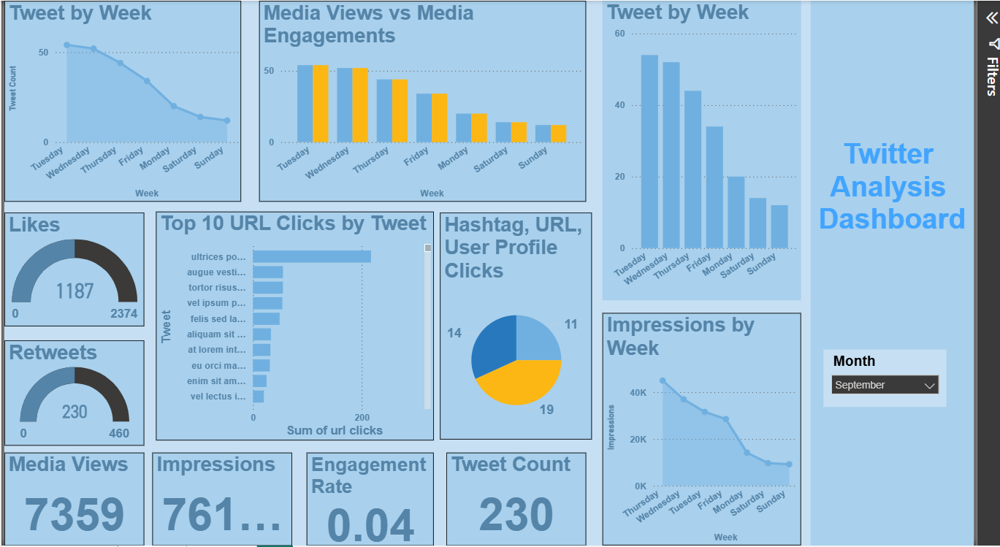
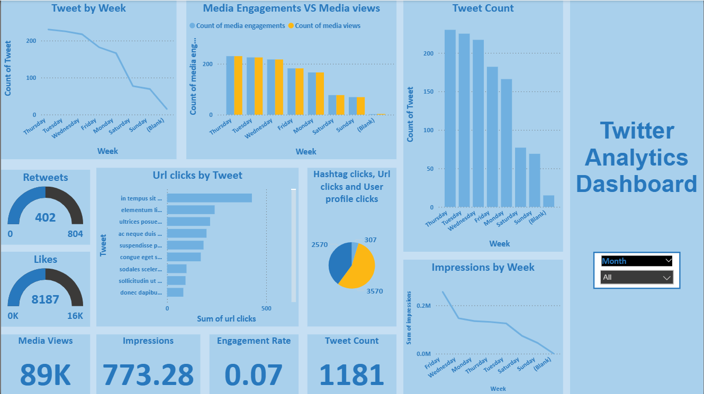

# Twitter Analytics Dashboard (Power BI)

## Overview
This project analyzes Twitter data to track engagement patterns, tweet performance, and user interaction trends.

## Objective
To identify high-performing content and optimize social media engagement strategies.

## Tools Used
- Power BI
- DAX
- Excel

## Key Features
- Tweet performance analysis (likes, retweets, impressions)
- Weekly trend analysis
- URL and hashtag engagement tracking
- Media engagement vs media views comparison

## Insights
- Engagement varies across different days of the week
- Certain tweets drive higher user interaction
- Media content increases engagement rates

## Dashboard Preview

### Monthly Performance (Example Month)

### Overall Trends Across All Months

This dashboard supports both monthly-level analysis and overall trend evaluation across multiple time periods.
